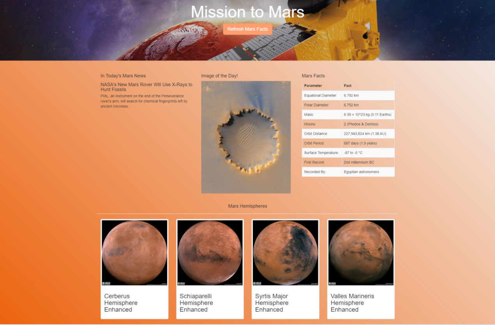
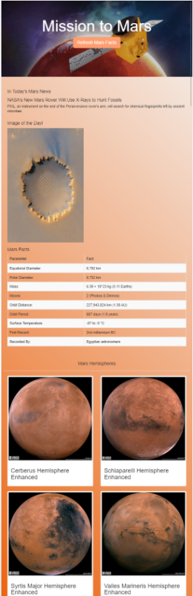

# Mission-to-Mars

Mission to Mars project is to scrape various web pages to scrape data about Mars and present them on visual appealing web page. 

Splinter and BeautifulSoup are used to scrape data. Flask, HTML, Bootstrap and CSS are used to present data. 

## Scraping Process

The data displayed on the main page is gathered from various sources and strored in a local MongoDB.

The main page, [index.html](templates/index.html) is rendered on a desktop browser like this:

**Refresh Mars Facts** button is for getting new data from given sources.

**In Today's Mars News** displays the top most news item from [News – NASA’s Mars Exploration Program](https://mars.nasa.gov/news/) page.

**Image of the Day!** displays the featured image of Mars from [Space Images](https://www.jpl.nasa.gov/spaceimages/?search=&category=Mars) page.

**Mars Facts** section displays some fun facts about Mars that is scraped from [Spaces-Facts](http://space-facts.com/mars/). The scraped data is retrieved as pandas data frame and then converted as HTML table.

The page also displays thumbnail images and titles of Mars Hemispheres scraped from [USGS Astrogeology](https://astrogeology.usgs.gov/search/results?q=hemisphere+enhanced&k1=target&v1=Mars) page.

Using bootstrap classes, the page is also designed to be responsive for various mobile devices. 

Here is the page view with iPad view.

